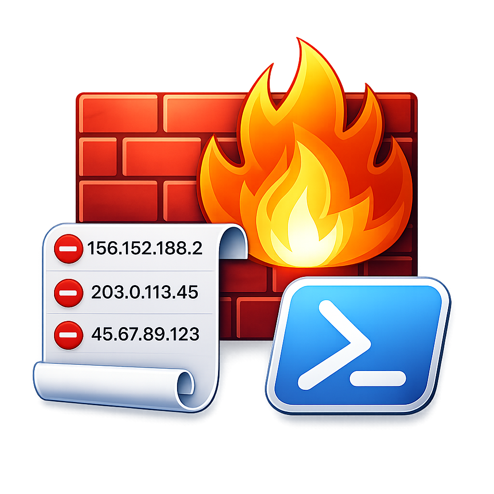
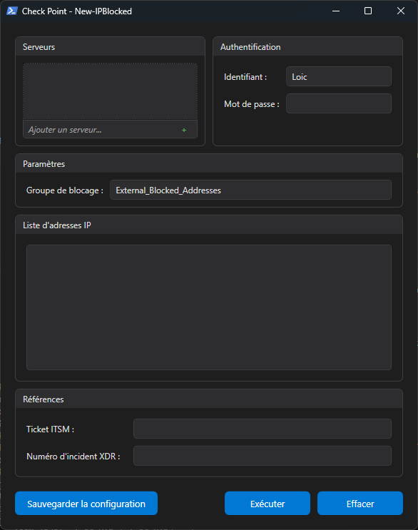

# New-IPBlocked

<div>
  

  A PowerShell WPF tool for blocking IP addresses on Check Point firewalls via the Management API. Supports single IPs, networks (CIDR), and IP ranges with automatic policy deployment.

  
  
  
</div>
<br clear="left" />

## Features

- **Modern WPF Interface** with adaptive dark/light theme
- **Multi-server support**: block IPs across multiple Check Point management servers in one operation
- **IP format detection**: automatically handles single IPs, CIDR networks, and IP ranges
- **Duplicate detection**: checks if an IP is already present in the block group before adding
- **Automatic policy deployment**: publishes changes and installs policies on relevant gateways
- **Persistent configuration**: saves server list, block group name, and per-user credentials
- **ITSM & XDR references**: tracks ticket numbers in object comments for auditability

## Screenshot



## Requirements

- Windows 10/11
- PowerShell 5.1 or later
- Network access to Check Point Management API (port 4434)

## Quick Start

1. Run the script:
   ```powershell
   .\New-IPBlocked.ps1
   ```

2. Add your Check Point management server(s)
3. Enter your API credentials
4. Paste IP addresses to block (one per line, or free text — IPs are extracted automatically)
5. Fill in the ITSM ticket and optional XDR incident number
6. Click **Execute**

## Configuration

Configuration files are stored in the `input/` folder:

| File | Content |
|------|---------|
| `New-IPBlocked.json` | Server list and block group name (shared) |
| `New-IPBlocked_<username>.json` | Per-user API username |

Click **Save configuration** in the GUI to persist settings.

## How It Works

1. Connects to each configured Check Point management server via the Management API
2. For each IP address:
   - Parses the IP format (host, network, or range)
   - Checks if already present in the block group
   - Creates the appropriate network object (host, network, or address range)
   - Adds the object to the specified block group
3. Publishes the session
4. Identifies production policy packages containing the block group
5. Installs updated policies on public-facing gateways

## Project Structure

```
New-IPBlocked/
├── New-IPBlocked.ps1              # Main script (GUI + logic)
├── .gitignore
├── README.md
├── LICENSE
├── input/                         # Configuration files (gitignored)
│   ├── New-IPBlocked.json         # Shared config (servers, block group)
│   └── New-IPBlocked_<user>.json  # Per-user config (username)
└── UDF/                           # Required PowerShell modules
    ├── PSSomeCheckPointNPMThings/ # Check Point Management API
    ├── PSSomeAPIThings/           # API utilities
    ├── PSSomeCoreThings/          # Core utilities
    ├── PSSomeDataThings/          # Data handling
    ├── PSSomeGUIThings/           # WPF GUI framework
    └── PSSomeNetworkThings/       # IP parsing & validation
```

## Disclaimer

This project is not affiliated with, endorsed by, or associated with Check Point Software Technologies Ltd. Check Point is a registered trademark of Check Point Software Technologies Ltd. This tool is an independent project developed to automate IP blocking operations on existing Check Point infrastructure.

## Author

**Loïc Ade**

## License

This project is licensed under the [PolyForm Noncommercial License 1.0.0](https://polyformproject.org/licenses/noncommercial/1.0.0/). See the [LICENSE](LICENSE) file for details.
